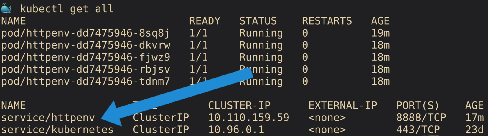
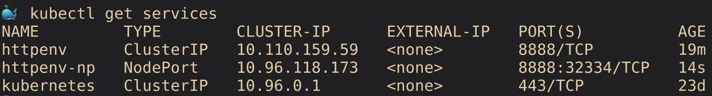
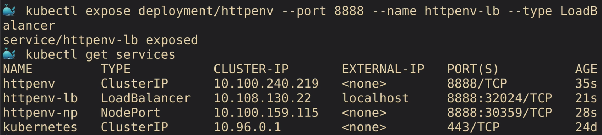

## Create a NodePort Service

<br/>



<br/>

When I do a kubectl get all, I should see here that I have one Deployment that has a replica set of five. Then you'll have the Kubernetes default service, which is always there. Then the httpenv cluster IP service. We've created an IP address inside the cluster for others to access it with the friendly name of httpenv because that's the service name.

Let's create one that's exposed externally on the host IP. This would be, if you were maybe in a data center or somewhere that you didn't have a load balancer you could control with the load balancer service, which we'll talk about a minute. You just basically, in this case, want to do a NodePort where you get ports somewhere in the high range of your Kubernetes cluster that you can use to talk from the outside in.

• Let's expose a NodePort so we can access it via the host IP (including localhost on Windows/Linux/macOS)

```
kubectl expose deployment/httpenv --port 8888 --name httpenvnp --type NodePort
```

<br/>



<br/>

If I go back and do a kubectl get services, you'll see a new one there that's type NodePort.
The port on the left, in this case, is the one inside the cluster, inside the container itself that's listing. Then the port on the right is the port that's on your nodes exposed to the outside world.

That port is from a default range for NodePorts that are preset inside your container cluster(Range 30000~32767). It's a high range. The hope here is that there's no conflicts, right. That there's nothing else on your system, by default, running on those ports.

• These three service types are additive, each one creates the ones above it:

    - ClusterIP
    - NodePort
    - LoadBalancer

<br/>

## Add a LoadBalancer Service

• If you're on Docker Desktop, it provides a built-in LoadBalancer that publishes the --port on localhost

```
kubectl expose deployment/httpenv --port 8888 --name httpenvlb --type LoadBalancer
 curl localhost:8888
```

• If you're on kubeadm, minikube, or microk8s

- No built-in LB
- You can still run the command, it'll just stay at "pending" (but its NodePort works)

<br/>



## How to clean up

```
kubectl delete service/httpenv service/httpenv-np
kubectl delete service/httpenv-lb deployment/httpenv
```

## Reference

[nodeport](https://kubernetes.io/docs/concepts/services-networking/service/#nodeport)
