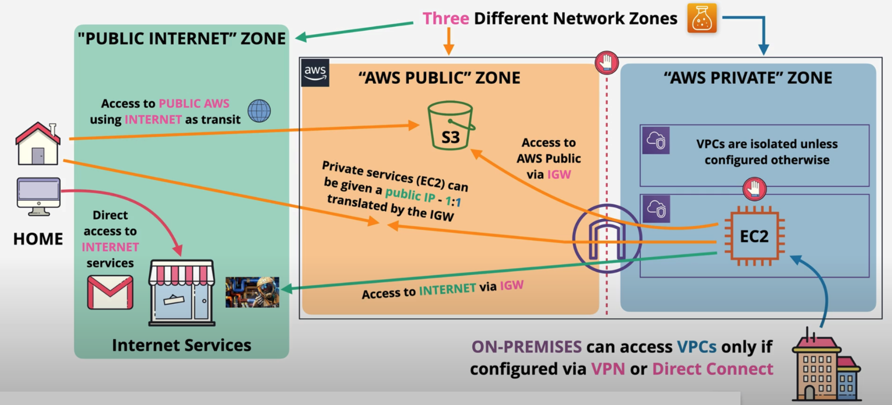
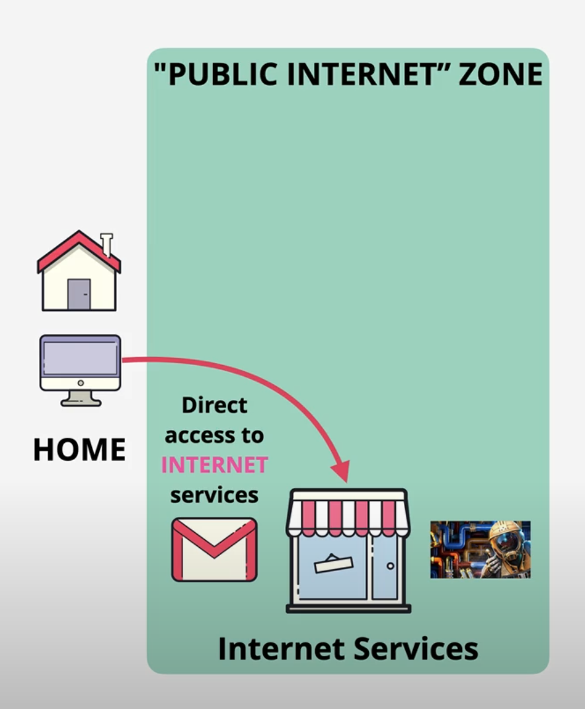
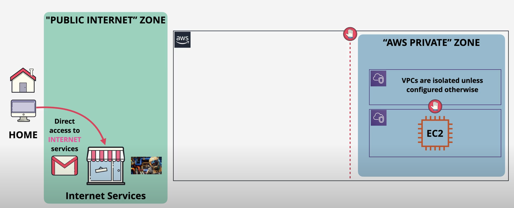
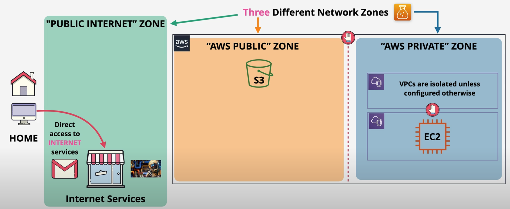

# Public vs Private Services
3 network zones relating to AWS Services

- Public Internet
- AWS Public Zone
- AWS Private Zone

## 1. Public service

Public service is accessible to everyone and private service isn't. When we hear the term AWS private service and AWS public service, it's referring to networking only.

A public service is something which is accessed using public endpoints, such as the simple storage service known as S3, and it can be accessed from anywhere which has an interent connection.

## 2. AWS private service

A AWS private service is something which runs within a VPC. So only with in the vpc or what is connected to that VPC can access the service. For both of these, there are permissions as well as networking.

So even though S3 is a public service by default, an identity other than the account root user has no authorization to access that resource. So permissions and networking are two different considerations when talking about access to a service.

When reviewing public vesus private services, it's the networking which matters. When thinking about any sort of public cloud environment, most people instinctively think of two parts: Two types of the network or two zones. First is the internet.

 

 
This is the zone where internet based service operates from. Things like online stores, g-mail and various online games. So if you're sat at home playing and online game or watching training videos, chances are you are connecting to the internet via an interent service provider. So this is the internet zone.

 

### 2.1 AWS private zone

 

 

Then we have private networks. so if you're watching this video from home then your home network is an example of the private network. Only things which are directly connected to a network port within your house or people who have your WI_FI password can operate in yout personal private zone network.

Now AWS also have private zones. and these are called Virtual Private Clouds or VPCs. These are isolated so VPCS can't communicate with each other unless you allow it. And nothing from the internet can reach these private networks unless you configure it. 

Services can be placed into these private zones such as EC2 instances. and just like with your home network. it can only access the internet and the internet can only access it if you allow it and you configure it. Many people think this is how AWS is architected that there are two network zones, the internet and private zones, but there's actually a third zone on the AWS public zone.

### 2.2 AWS public zone

 

 

And this runs between the public internet and the AWS private zone networks. So this is not on the public internet and it's not part of the public internet. It's a network which is connected to the public internet. `Now this distinction might seem irrelevant but the distinction rarely matters`. This AWS public zone is the network zone where AWS public service operate from. Services with public endpoints such as S3.

So just to sumarize, try and really understand this fundamental concept. We've got three different networks zones, the public internet, the AWS private zone, which is where VPCs run from and the AWS public zone, which sits in the middle and this is where AWS public service oprate from.

Now, if you access AWS public services from anywhere with a public internet connection, your communication uses the public internet for transit to and from this AWS public zone. This is why you can access AWS public services from anywhere with an internet connection because the internet is used to carry package from user to the AWS public zone and back again for the return journey. 

### Other ways of connections in private zone

1. VPN or Direct Connect

You can also configure virtaul or physical connections between on premises networks and AWS VPCs. So private network can be connected together, but agian only if you decide to allow it. 

 

 

2. Internet Gateway

You can also create and attach internet gateway to a VPC. This provides a few additional pieces of funcionality.

First, it allows private zone resources to access the public internet as long as EC2 in this example has an allocated public IP address.

It also allows access to public AWS services such as S3 but crucially, this data doesn't touch the public internet at any point. It communicates with the public service using the aws public zone. 

3. etc..

It's possible to give private resources such as EC2 instances of public IP address. And this allows the resource to be accessed from the public internet. 

Architecturally, it is projecting the EC2 instance into the public zone so that all of that instance, or part of it can be communicated with from the public internet. 

## Summary

So this is the architecture, the three different networks zonez: public internet, the AWS public zone and the AWS private zone. 