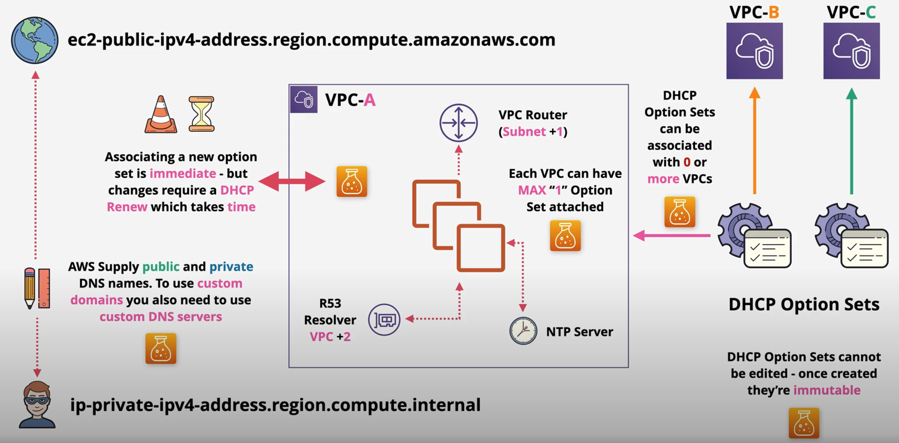

# DHCP

The Dynamic Host Configuration Protocol (DHCP) provides a standard for passing configuration information to hosts on a TCP/IP network. The options field of a DHCP message contains configuration parameters, including the domain name, domain name server, and the netbios-node-type. When you create a VPC, AWS automatically create a set of DHCP options and associates them with the VPC. You can configure your own DHCP options set for your VPC.