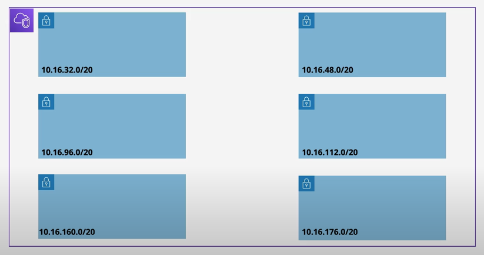
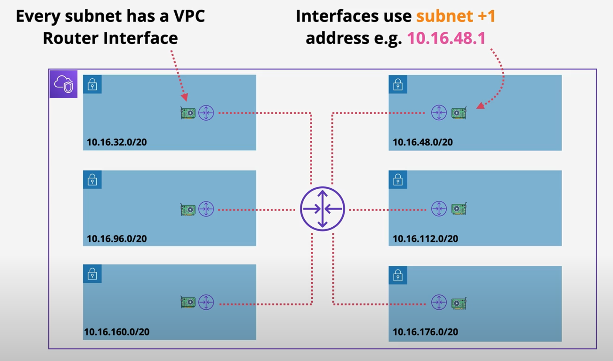
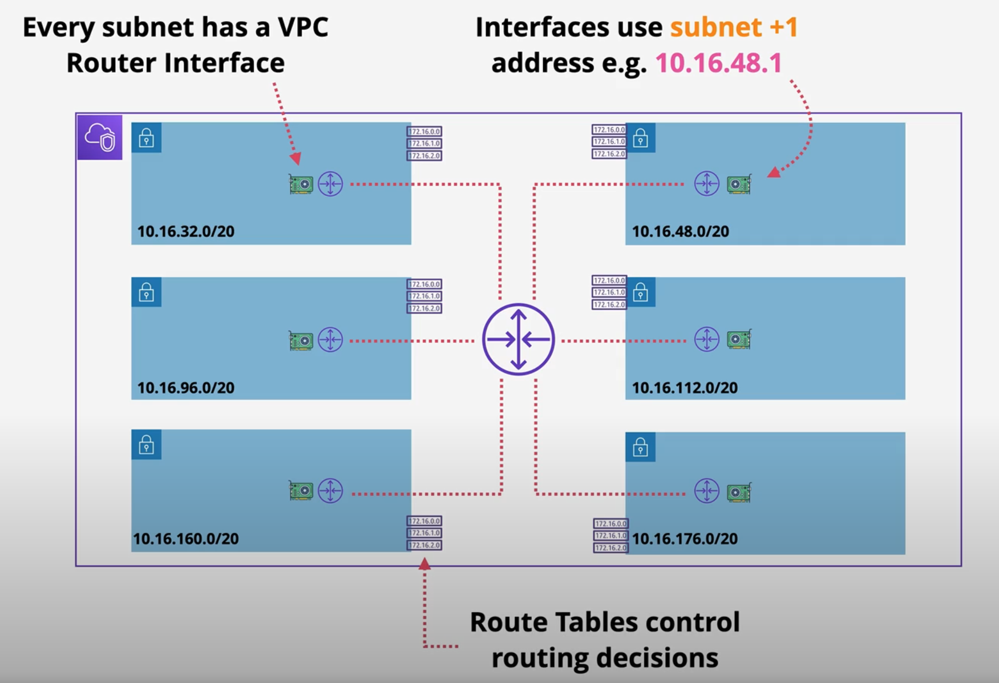
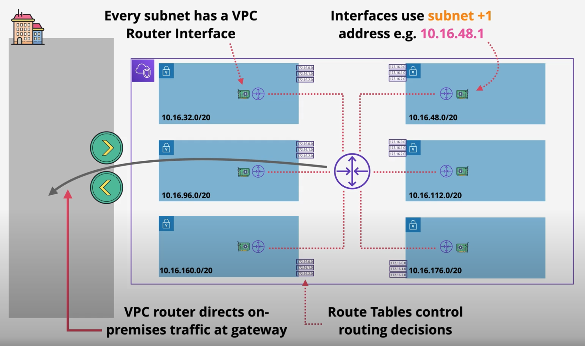
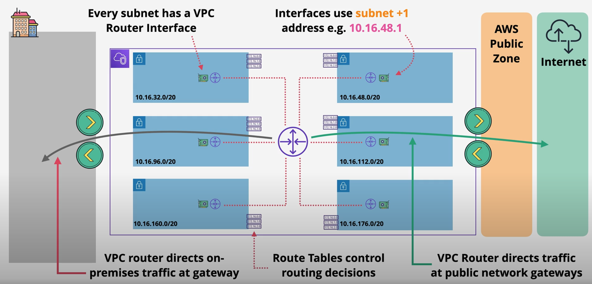
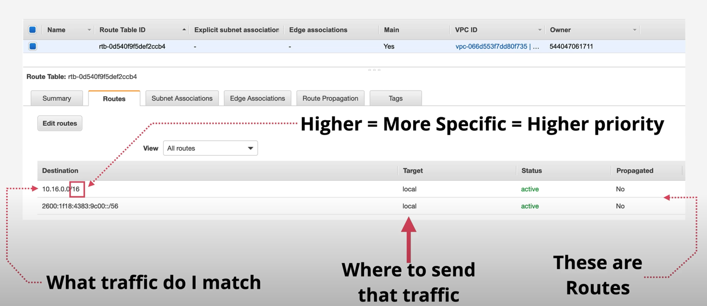

# VPC Router

Each VPC has an implicit router, and you use route tables to control where network traffic is directed. Each subnet in your VPC must be associated with a route table, which controls the routing for the subnet (subnet route table). We can explicitly associate a subnet with a particular route table. Otherwise, the subnet is implicitly associated with the main route table. A subnet can only be associated with one route table at a time, but we can associate multiple subnets with the same subnet route table.

- Virtual Router within a VPC 
- Highly Available - across all AZs in that region 
- Scalable - no performance management required. 
    
    => It delievers whatever performance the resources within the VPC provides.
- Routes traffic between subnets. 
    
    => Remember subnets can be in different availability zones, so potentially in dfferent underlying physical facilities, the VPC ensures that data gets from one subnet to another. 
- Routes `from external` networks `into` the `VPC` 
- ... `from` the `VPC` to `external networks`. 

    => External networks can mean other VPCs on premises networks or the cloud platforms, and even the public internet. Other networking gateway is required for these connections to be active, such as the internet gateway for internet connectivity but it's the VPC router, which controls the routing within the VPC to or from those other networks. The VPC router has an interface in every subnet within the VPC. And this is known as the subnet+1 one address.

- interface in every subnet ... "subnet+1" address (default GW via DHCP Option Set)
- Controlled using `route tables`

## Example)

 
There are two subnets in each of three availability zones. and it uses the same IP range. The VPC itself is using 10.16.0.0/16 and each subnet uses a /20 range within the VPC.

 

 

The VPC router conceptually sits in the middle of the VPC.

From a networking perspective though, each subnet has an interface for the VPC router inside that subnets. Those interfaces use subnet+1 address. 

So in the case of the subnet at the top right, the subnet address is 10.16.48.0, and the VPC router interface would use 10.16.48.1.

Any services running inside the subnets have this plus one address as their default gateway. And so any packets which are destined fo outside of that local subnet use the plus one address as the default gateway and VPC router controls where the data goes from that point forward. 

 

 

Now the decisions that the VPC router makes are controlled via route tables, and these are associated with subnets within the VPC.
It's the VPC router configured with route tables together with other gateway objects, which can direct traffic entering and leaving the VPC.

 

 

For example, for on-premise networks, the VPC router will ensure that data from the VPC reaches the on-premise network, generally using a netork gateway object, such as the transit gateway or virtual private gateway.

 

 

 Alternatively, using public network gateways can ensure that VPC traffic reaches services in the AWS public zone or the public internet. All of this is controlled by the creation and modification of route tables.

- Every VPC is created with a Main route table (RT) 
- .. default for every subnet in the VPC
- Custom route tables can be created and associated with subnets in the VPC - removing the Main route table
- `Subnets` are `associated` with `one route table only` (Main or Custom)

Therefroe, if you create a custom route table, you can associate that custom route table with any subnets within that VPC. Once you do associate it, the main route table is diassociated. if you disassociated the custom route table, the main route table is associated again with those subnets. In general, main route table should be left blank. Any routes that you want to create should be added to a custom route table, and these custom route tables can be expilicity associated with VPC subnets.

- Route tables contain routes - most specific routes first.
    
    => A route table can contain many routes, and these are used to match traffic by the VPC router. Now there is a priority order and that's the most specific route wins. A /32 route is the most specific IP version 4 route you can use, and this matches one specific IP address. The other extreme of that is `0.0.0.0/0` which is a default IP version 4 route and this matches any IP version 4 address. And so when processing route tables, the VPC router attempts to pick the most specific route.

- Route tables can be associated with gateways 

## Example

Let look at how route tables are presented within the console UI. 

This is the main route table for this specific VPC. A route table is just a list of routes, and each of these is a route. When traffic is leaving the subnet that this route table is associated with, the VPC router reviews the IP packet. A packet has a source address and the desination address together with some data. The VPC router looks at the destination address of all of the packets leaving their subnet, and when it has those addresses, it looks at the route table and identifies all the routes which match that desination address. And it does this by checking the destination field of every route within the route table. This determines what the route matches. 

Now a route can match one specific destination IP address. So a route could be a single IP with a /32 prefix. A route could also be a network match, so matching one or more networks. Or it could be a default route. 

For IP version 4, this might be 0.0.0.0/0 which matches all IP version 4 IPs. This is known as a default route, which is a catch-all.

Now, in the case where traffic leaving a VPC subnet only matches one route, well then that one route is selected. if multiple routes match, maybe there's a specific /32 route which mateches. Maybe there's also a /16 network match. and maybe there's also a 0.0.0.0/0 default route.

In this case, the prefix is uses as a priority. `The higher the rpefix value, the more specific the route and the higter priority the route has`. So a /32 route is preferenced over a /16 a /0. 

Once one route within a route table has been selected as the best match for traffic leaving that VPC subnet, the traffic is forwarded to its destination, which is a gateway inside AWS which gets the traffic through to its final destination. an alternative is that we also have the target of local, and this means the destination is in the VPC. All route table have at least one route, the local route, and this matched the entire VPC CIDR range. It lets the VPC router know that traffic destined for any IP address within the VPC CIDR is local and it can be delivered directly. 

If the VPC is IP version 6 enabled, it also can have IP version 6 routes. And there is also going to be a local IP version 6 route. which matches the IP version 6 CIDR for the VPC. So the bottom route in this route table is the local route for the IP version 6 CIDR associated with this VPC. 

These local routes can never be updated. They're always present and the local routes always take priority. They're the exception to the previous rule. It is possible to create a route table and not associate it with any subnets, but a subnet has to have an associated route table: Either the main route table or a custom one that you create. 

## Summary

A route table controls what happens to data as it leaves the subnet or subnets that route table is associated with. Local routes are always there uneditable and match the vPC IP version 4 and IP vesion 6 CIDR ranges. For anything else hight prefix values are more specific and take priority. 
