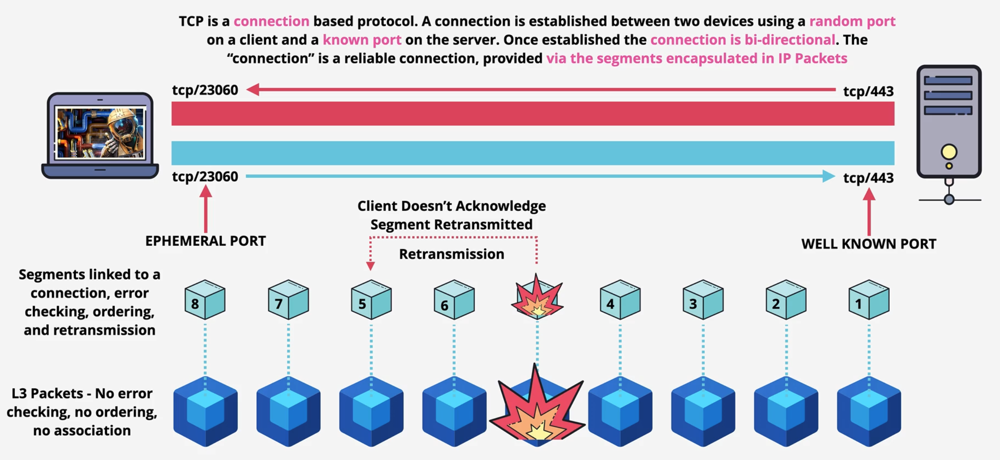
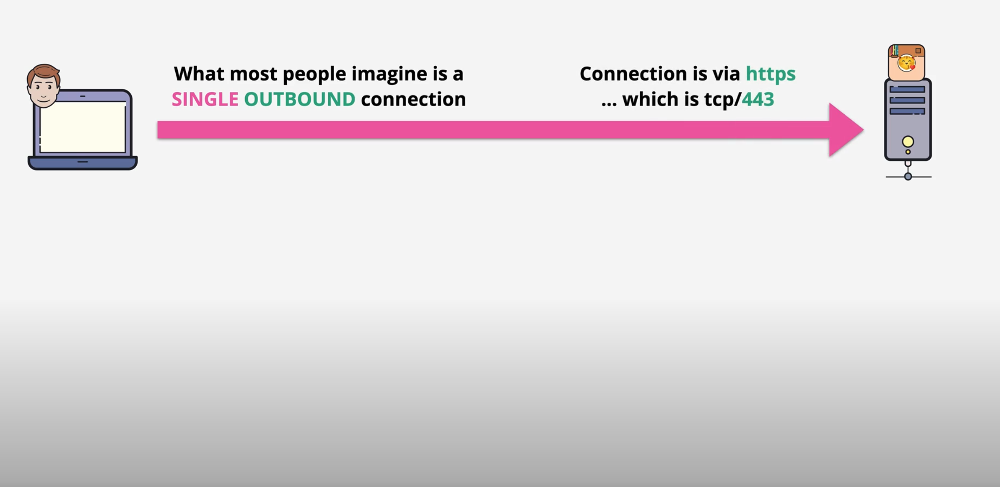
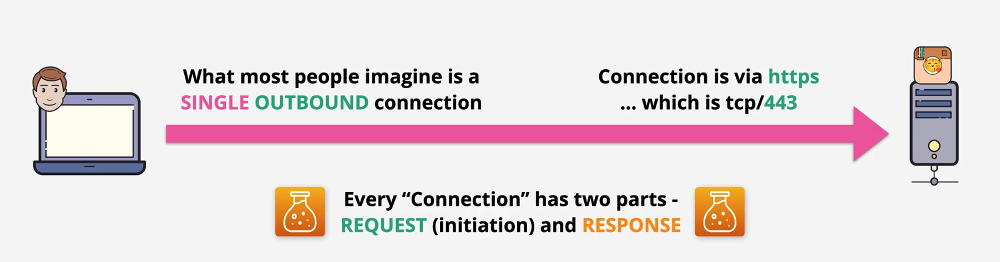
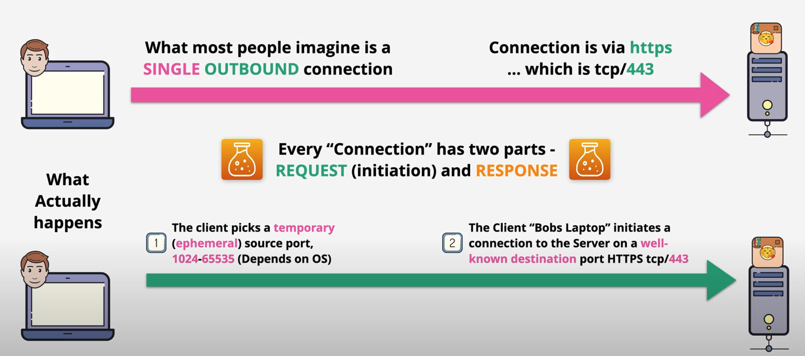
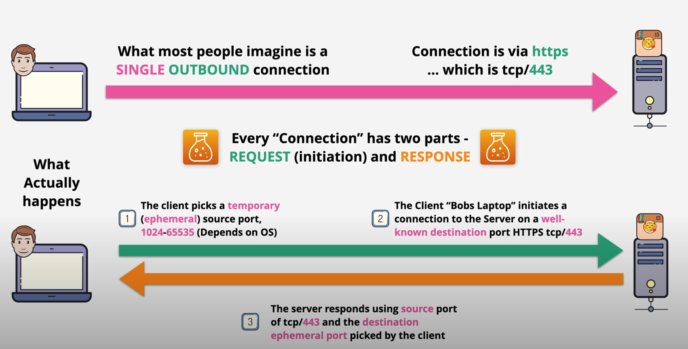
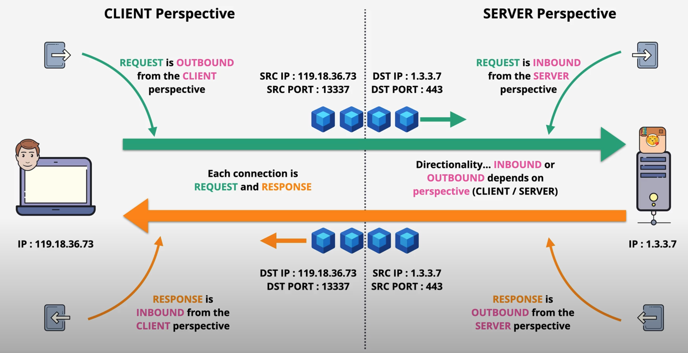

# Stateful vs Stateless Firewalls

Network access control lists, and security groups.

Two key security features in AWS VPCs, are Network access control lists, and security groups.

There are big differences between stateful and stateless firewalls.

Transmission Control Protocol (TCP)

TCP is a connection based protocol. A connection is established
Between two devices using a random port on a client and known port on the server. Once established the connection is bi-directional. The “connection” is a reliable connection, provided via the segments encapsulated in IP Packets.

In the networking fundamentals part of the course, I talked about how TCP and IP worked together.You might already know this if you have networking experience in the real world that when you make a connection using TCP, what’s actually happening is that each side is sending IP packets to each other. These IP packets have a source and destination IP and carried across local networks and the public internet.

Now TCP is a Lab 4 protocol, which runs on top of IP. It’s adds error action together with the idea of ports. So HTTP runs on TCP port 80, and HTTPS runs on TCP port 443 and so on. So Keep that in mind as we continue talking about the state of connections.

So let’s say that we have a user here on the left, Bob, and he’s connecting to the datagram application running on a server on the right.
What most people imagine in this scenario is a single connection between Bob’s laptop and the server.

So Bob’s connecting to TCP port 443 on the server and in doing so he gets information back. In this case, many different cat images. Now, you know that below the surface at lathery this single connection is handled by exchanging packets between the source and the destination. Conceptually though, you can imagine that each connection in this case, it’s and outgoing connection from Bob’s laptop to the server, each one of these is actually made up of two different parts.

First, we’ve got the request part where the client requests some information from a server, in this case on cat images. And then we have the response part where that data is returned to the client. Now, these are both parts of the same interaction between the client and server, but strictly speaking, you can think of these as two different components.

What actually happens as part of this connection setup is this.

First, the client picks a temporary port and this is known as an ephemeral port. Now, typically this port has a value between 1024 and 65535. But this range is dependent on the operating system, which Bob’s laptop is using. Then once this ephemeral port is chosen, the client initiate a connection to the server using a well-known port number. Now a well-known port number is a port number which is typically associated with on specific popular application or protocol. In this case, TCP port 443 is HTTPS. So this is the request part of the connection. It’s a stream of data to the server. You’re asking for something, some cat pictures or a webpage.

Next, the server responds back with the actual data. The server connects back the source IP or the request part, in this case, Bob’s laptop. And it connects to the source port of the request part. Which is the ephemeral port, which Bob’s laptop has chosen. This part is known as the response.
So the request is from Bob’s laptop using an ephemeral port to a server, using a well known port. The response is from the server on that well-known port, to Bob’s laptop, on the ephemeral port.

Now it’s theses values which uniquely identify a single connection. So that’s a source port and source IP and a destination IP. Now I hope that this makes sense so far, if not, then you need to repeat this first part of the video again. Because this is really important to understand.

Now let;s look at this example in a little bit more detail.

This is the same connection that we looked at on the previous screen. we have Bob's laptop on the left, and the cartogram server on the right.

Obviously, the left is the client, and the right is the server. I aslo introduced the correct terms on the previous screen. So request and response. so the first part is the client talking to the server, asking for something, and that's the request. and the second prat is the server responding, and that's the response. But what I want to get you used to is that the directionality depends on your perspective. and let me explain what I mean.

So in this case, the client initiates the request. And I've added the IP addresses on here for both the client and the server. So what this means is that packets will be sent from the client to the server, and theses will be flowing from left to right. These packets are going to have a source IP address of 119.18.36.73, which is the IP address of the client, so Bob's laptop. And They wil have a destination IP of 1.3.3.7, which is the IP address of the server. Noiw the source port will be a temporary or emphemeral port chosen by the client. And the desitnation port will be a well-known port. In this case, we are using HTTPS, so TCP port 443. Now, if I challenge you to take a quick guess, would you say that this request is outbound or inbound? If you had to define a firewall rule right now, would you pick inbound or outbound? Well, this is actually a trick question because because it's both.

From the client perspective, this request is an outbound connection. So if you're adding a firewall rule on the client, you would be looking to allow or deny an outbound connection.

From the sever perspaective though, it's an inbound connection.
So you have to think about perspective when you're working with firewalls, but then we have the response part from the server through to the client. This will also be a collection of packets moving from right to left. This time, the source IP on those packets will be 1.3.3.7, which is the IP address of the server. The destination IP will be 119.18.36.73, which is the IP address of the client, so Bob's laptop. The source port will be TCP port 443, which is the well-known port for HTTPS. And the destination port will b the ephemeral port chosen orignially by the client.

Now, again, I want you to think about the directionality of this component of the communication. Is is outbound or inbound? Well, again, it depends on perspective. The server sees it as an outbound connection from the sevrver to the client, and the client seees itas an inbound connection from the server to itself.

Now, this is really important because there are two things to think about when dealing with firewall rules. The first is that each connection between a client and a server has two components, the request and the response. so the request is from a client to a server and response is from a server to a client. The response is always the inverse direction to the requset but the direction of the request isn't always outbound and isn't always inbound.
