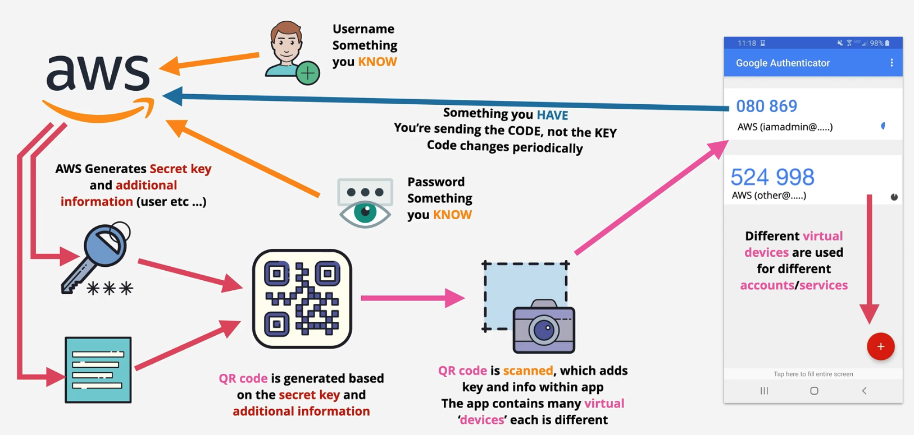
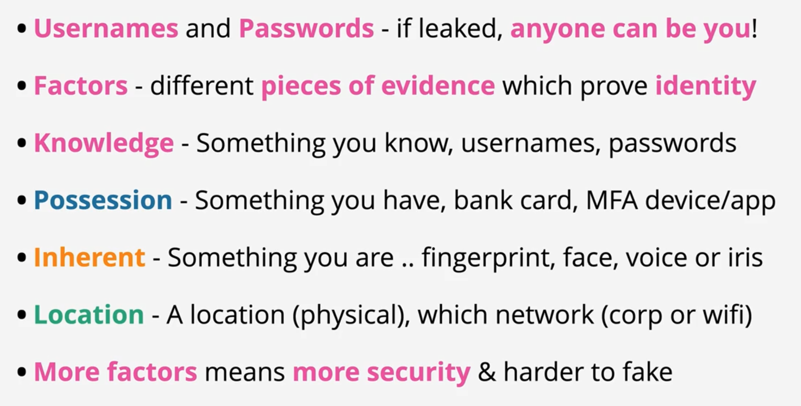

# AWS Multi-Factor Authentication

 

AWS Multi-Factor Authentication (MFA) is a simple best practice that adds an extra layer of protection on top of your user name and password. With MFA enabled, when a user signs in to an AWS Management Console, they will be prompted for their user name and password (the first factor—what they know), as well as for an authentication code from their AWS MFA device (the second factor—what they have). Taken together, these multiple factors provide increased security for your AWS account settings and resources.

 

