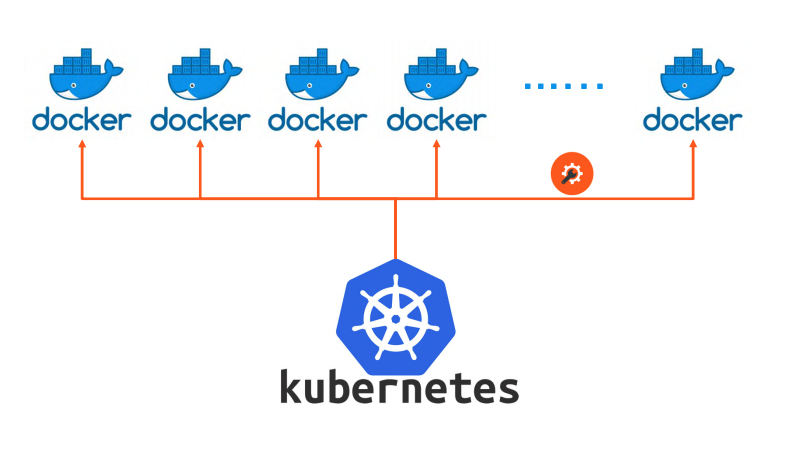

# What is Kubernetes?

    • Kubernetes = popular container orchestrator
    • Container Orchestration = Make many servers act like one
    • Released by Google in 2014, maintained by large community
    • Runs on top of Docker (usually) as a set of APIs in containers
    • Provides API/CLI to manage containers across servers
    • Many clouds provide it for you
    • Many vendors make a "distribution" of it

What **Orchestrator** does is that it takes your containers (that you ask it to run), a series of servers, or nodes, and decides how to run those container workloads across those nodes.

Kubernetes essentially is a set of APIs that run on apps in containers to manage a set of servers and then execute your containers on Docker, by default. It can also run other container runtimes that aren't Docker. It's just a series of containers on top of that that manage the multi-node system that it's controlling.

Then, it gives you a set of those APIs and command line tools to deploy and maintain the same server infrastructure that you would have similar to Swarm.

 

# Advantages of Kubernetes

    • Clouds will deploy/manage Kubernetes for you
    • Infrastructure vendors are making their own distributions
    • Widest adoption and community
    • Flexible: Covers widest set of use cases
    • "Kubernetes first" vendor support
    • "No one ever got fired for buying IBM"
    • Picking solutions isn't 100% rational
    • Trendy, will benefit your career
    • CIO/CTO Checkbox

## Reference

[History of Kubernetes](https://en.wikipedia.org/wiki/Kubernetes)

[Official Kubernetes website](https://kubernetes.io/)
