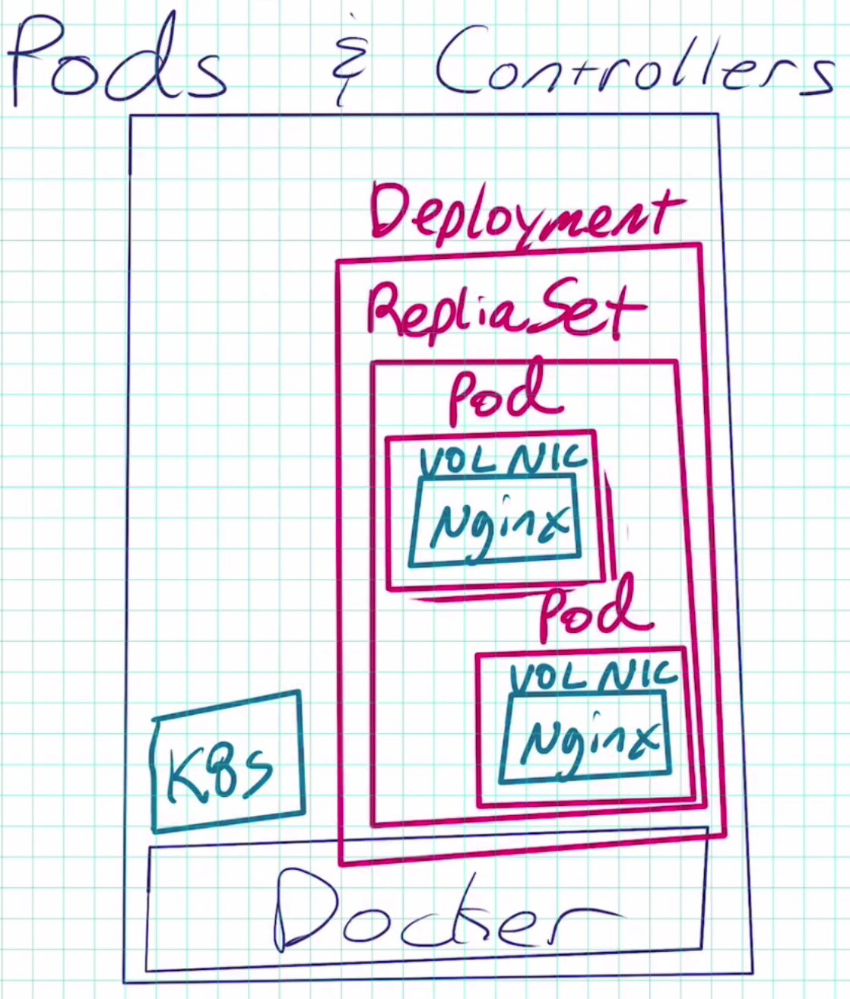
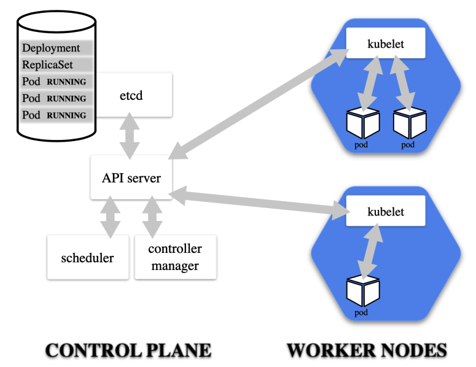

## 1. Kubernetes Container Abstraction

    • Pod: one or more containers running together on one Node
        - Basic unit of deployment. Containers are always in pods
    • Controller: For creating/updating pods and other objects
        - Many types of Controllers inc. Deployment, ReplicaSet, StatefulSet, DaemonSet, Job, CronJob, etc.
    • Service: network endpoint to connect to a pod
    • Namespace: Filtered group of objects in cluster
    • Secrets, ConfigMaps, and more

The `pod` is the basic unit of deployment. We deploy these pods, and we use things on top of that known as `controllers` to control those pods.

`Controller` is an object that continually sits there and validates whether or not what's going on inside of Kubernetes is what you've asked it to do. It's a differencing engine that has different types.˝

The `service` is the endpoint that you give to a set of pods. It just means you're giving it a persistent endpoint in the cluster so that everything else can access that set of pods at a specific DNS name and port.

`Namespace` is just a filter on your view at the command line.

<br/>

## 2. Kubectl commend style (Run, Create, and Apply)

• Kuberentes is evolving, and so is the CLI
• We get three ways to create pods from the kubectl CLI

```
kubectl run (changing to be only for pod creation)
kubectl create (create some resources via CLI or YAML)
kubectl apply (create/update anything via YAML)
```

<br/>

### 2.1 Creating Pods with kubectl

• Are we working?

```
kubectl version
```

• Two ways to deploy Pods (containers): Via commands, or via YAML

• Let's run a pod of the nginx web server!

```
kubectl create deployment my-nginx --image nginx
```

• Let's list the pod

```
kubectl get pods
```

• Let's see all objects

```
kubectl get all
```

### 2.2 Pods => ReplicaSet => Deployment

<br/>



As a reminder, we have Docker running underneath. Then we have some containers running that are managing Kubernetes.

When we did the `kubectl create deployment`, what it created was our `Nginx container and Deployment`.

The different levels of control, or abstractions, are the interesting part. The first one is pod and it created the NIC for the pod. (note: It can run one or more containers inside this pod)

The way it created that pod it also created a `Deployment`. A Deployment controller manages `ReplicaSets`. So We have multiple levels of abstraction.

Deployment does things such as rolling updates, or Blue/Green Deploys.
When that Deployment was created, it created a ReplicaSet of one. `That itself is another controller`.

`The ReplicaSet's job is to make sure that the number of pods we asked for are currently running`.

The Deployment's job is to manage the ReplicaSet configuration.

### 2.3 How to cleanup

<br/>

• Let's remove the Deployment

```
kubectl delete deployment my-nginx
```

### 2.4.1 Scaling ReplicaSets (Tutorial)

Start a new deployment for one replica/pod

```
kubectl create deployment my-apache --image httpd
```

• Let's scale it up with another pod

```
// those are the same command
// deploy = deployment = deployments
kubectl scale deploy/my-apache --replicas 2
kubectl scale deployment my-apache --replicas 2
```


<br/>
Because we have extra levels of abstraction, we need to understand how these levels react to each other.

When we typed the scale command, we were technically updating the Deployment spec. In Kubernetes, everything has a spec. This spec for the `Deployment` changed the `ReplicaSet` to a set of two replicas. Then that ReplicaSet controller decided to change it to two pods, and there would be one pod for each replica. Then the `control plane` makes a decision about which nodes, in this case you've only got one node, but which nodes would get assigned those pods. Then if you had a multi-node setup, the `kubelet` agent would then get assigned that pod and would take that for execution to create the container on his local Docker Engine.

With Kubernetes, we get these additional layers of abstraction. That does introduce a slight delay compared to maybe something you would do
Docker or Swarm. But really, in most cases, it's negligible. The tradeoff is we get much more flexibility and control with these different layers of abstraction.

<br/>

`<What Just Happened? kubectl scale>`



<br/>

### 2.4.2 Inspecting Deployment Objects (tutorial)

• Get container logs

```
kubectl logs deployment/my-apache --follow --tail 1
```

Command with `--follow`, it will then wait for anything new to show up in the logs of that pod. And `--tail`, it just means return the last line only.

• Get a bunch of details about an object, including events!

```
kubectl describe pod/my-apache-xxxx-yyyy
```

• Watch a command (without needing watch)

```
kubectl get pods -w
```

• In a separate tab/window

```
kubectl delete pod/my-apache-xxxx-yyyy
```

• Watch the pod get re-created

## Reference

[Pods](https://kubernetes.io/docs/concepts/workloads/pods/)

[Service](https://kubernetes.io/docs/concepts/services-networking/service/)

[kubectl Cheat Sheet](https://kubernetes.io/docs/reference/kubectl/cheatsheet/)

[kubectl for Docker Users](https://kubernetes.io/docs/reference/kubectl/docker-cli-to-kubectl/)
