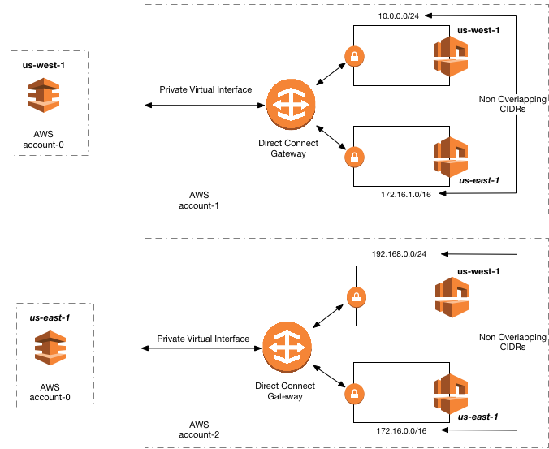

# AWS Direct Connect

is a cloud service solution that makes it easy to establish a dedicated network connection from your premises to AWS to achieve higher privacy benefits, additional data transfer bandwidth, and more predictable data transfer performance. Using AWS Direct Connect, you can establish `private connectivity between AWS and your datacenter, office, or colocation environment`, which in many cases can reduce your network costs, increase bandwidth throughput, and provide a more consistent network experience than Internet-based connections.

Using industry standard 802.1q VLANs, this dedicated connection can be partitioned into multiple virtual interfaces. Virtual interfaces can be reconfigured at any time to meet your changing needs. You can use an `AWS Direct Connect gateway` to connect your AWS Direct Connect connection over a private virtual interface to one or more VPCs in your account that are located in the same or different Regions. You associate a Direct Connect gateway with the virtual private gateway for the VPC. Then, create a private virtual interface for your AWS Direct Connect connection to the Direct Connect gateway. You can attach multiple private virtual interfaces to your Direct Connect gateway.

With Direct Connect Gateway, you no longer need to establish multiple BGP sessions for each VPC; this reduces your administrative workload as well as the load on your network devices.

 

## Case 1.

### Requirements

- a government agency has multiple VPCs in various AWS regions across the United States
- need to be linked up to an on-premises central office network in Washington, D.C.
- The central office requires inter-region VPC access over a private network that is dedicated to each region for enhanced security and more predictable data transfer performance.
- build this network mesh and to minimize the management overhead to maintain these connections.

### Solution

Utilize AWS Direct Connect Gateway for inter-region VPC access. Create a virtual private gateway in each VPC, then create a private virtual interface for each AWS Direct Connect connection to the Direct Connect gateway.

### Odap Note

`Link aggregation group (LAG)` is irrelevant in this scenario because it is just a logical interface that uses the Link Aggregation Control Protocol (LACP) to aggregate multiple connections at a single AWS Direct Connect endpoint, allowing you to treat them as a single, managed connection.

`AWS Transit Gateway` will not fulfill the conditions above. This option is best suited for customers who want to leverage AWS-provided, automated high availability network connectivity features and also optimize their investments in third-party product licensing such as VPN software.

Enabling inter-region `VPC peering` would require a lot of manual setup and management overhead to successfully build a functional, error-free inter-region VPC network compared with just using a Direct Connect Gateway. Although the Inter-Region VPC Peering provides a cost-effective way to share resources between regions or replicate data for geographic redundancy, its connections are not dedicated and highly available.

## References:

https://aws.amazon.com/blogs/aws/new-aws-direct-connect-gateway-inter-region-vpc-access/

https://docs.aws.amazon.com/directconnect/latest/UserGuide/direct-connect-gateways.html

https://aws.amazon.com/answers/networking/aws-multiple-region-multi-vpc-connectivity/

Check out this AWS Direct Connect Cheat Sheet:

https://tutorialsdojo.com/aws-direct-connect/
