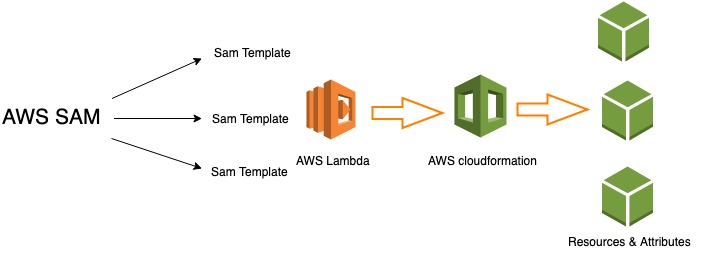

# AWS Serverless Application Model (AWS SAM)

The AWS Serverless Application Model (AWS SAM) is an open-source framework that you can use to build serverless applications on AWS. It consists of the AWS SAM template specification that you use to define your serverless applications, and the AWS SAM command line interface (AWS SAM CLI) that you use to build, test, and deploy your serverless applications.

 

Because AWS SAM is an extension of AWS CloudFormation, you get the reliable deployment capabilities of AWS CloudFormation. You can define resources by using AWS CloudFormation in your AWS SAM template. Also, you can use the full suite of resources, intrinsic functions, and other template features that are available in AWS CloudFormation.

You can use AWS SAM with a suite of AWS tools for building serverless applications. To build a deployment pipeline for your serverless applications, you can use CodeBuild, CodeDeploy, and CodePipeline. You can also use AWS CodeStar to get started with a project structure, code repository, and a CI/CD pipeline that's automatically configured for you. To deploy your serverless application, you can use the Jenkins plugin, and you can use Stackery.io's toolkit to build production-ready applications.

## Case 1.

- plans to decommission its legacy web application that is hosted in AWS.
- is composed of an Auto Scaling group of EC2 instances and an Application Load Balancer (ALB).
- tasked to set up a new serverless architecture that is comprised of AWS Lambda, API Gateway, and DynamoDB.- is required to build a CI/CD pipeline to automate the build process and to support gradual deployments.

## Solution

Use AWS Serverless Application Model (AWS SAM) and set up AWS CodeBuild, AWS CodeDeploy, and AWS CodePipeline to build a CI/CD pipeline.

### Odap-Note

`OpsWorks` lets you use Chef and Puppet to automate how servers are configured, deployed, and managed across your Amazon EC2 instances or on-premises compute environments. It can't deploy AWS Lambda applications.

`AWS Systems Manager Automation` is designed to configure and manage instances with custom runbooks or pre-defined runbooks maintained by AWS, not for building and deploying serverless applications on AWS Lambda.

`AWS Serverless Application Repository` is just a managed repository for serverless applications. This solution is incomplete as you will need other AWS tools to build and deploy your application.

## References:

https://docs.aws.amazon.com/serverless-application-model/latest/developerguide/what-is-sam.html

https://docs.aws.amazon.com/serverless-application-model/latest/developerguide/automating-updates-to-serverless-apps.html

## AWS Serverless Application Model Cheat Sheet:

https://tutorialsdojo.com/aws-serverless-application-model-sam/
