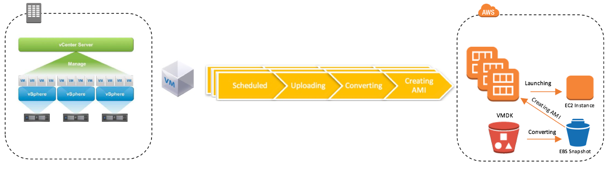

# AWS Server Migration Service

SAM automates the migration of your on-premises VMware vSphere, Microsoft Hyper-V/SCVMM, and Azure virtual machines to the AWS Cloud. AWS SMS incrementally replicates your server VMs as cloud-hosted Amazon Machine Images (AMIs) ready for deployment on Amazon EC2. Working with AMIs, you can easily test and update your cloud-based images before deploying them in production.

By using AWS SMS to manage your server migrations, you can:

- `Simplify the cloud migration process.` You can begin migrating a group of servers with just a few clicks in the AWS Management Console. After the migration has initiated, AWS SMS manages all the complexities of the migration process, including automatically replicating volumes of live servers to AWS and creating new AMIs periodically. You can quickly launch EC2 instances from AMIs in the console.

- `Orchestrate multi-server migrations.` AWS SMS orchestrates server migrations by allowing you to schedule replications and track the progress of a group of servers that constitutes an application. You can schedule initial replications, configure replication intervals, and track progress for each server using the console. When you launch a migrated application, you can apply customized configuration scripts that run during startup.

- `Test server migrations incrementally.` With support for incremental replication, AWS SMS allows fast, scalable testing of migrated servers. Because AWS SMS replicates incremental changes to your on-premises servers and transfers only the delta to the cloud, you can test small changes iteratively and save on network bandwidth.

- `Support the most widely used operating systems.` AWS SMS supports the replication of operating system images containing Windows, as well as several major Linux distributions.

- `Minimize downtime.` Incremental AWS SMS replication minimizes the business impact associated with application downtime during the final cutover.

AWS Server Migration Service is designed to simplify the end-to-end server migration process. AWS SMS currently supports the migration of on-premises virtual machines (VMs) as an agentless service using a virtual appliance. AWS SMS is an ideal solution to use when you are planning a scaled migration from VMware environments to AWS where the downtime, agentless tools, incremental replication, and testing the application before the cutover are critical considerations.

 

## Case 1.

## Requirements

A company has several virtual machines on its on-premises data center hosting its three-tier web application. The company wants to migrate the application to AWS to take advantage of the benefits of cloud computing. The following are the company requirements for the migration process:

- The virtual machine images from the on-premises data center must be imported to AWS.

- The changes on the on-premises servers must be synchronized to the AWS servers until the production cutover is completed.

- Have minimal downtime during the production cutover.

- The root volumes and data volumes (containing Terabytes of data) of the VMs must be migrated to AWS.

- The migration solution must have minimal operational overhead.

Which is the recommended solution to meet the company requirements?

### Solution

Create a job on `AWS Server Migration Service (SMS)` to migrate the virtual machines to AWS. Create a replication job for each application tier to sync the changes from the on-premises environment to AWS. Launch Amazon EC2 instances based on the images created from AWS SMS. After successful testing, perform a final replication before the cutover and launch new instances based on the updated AMIs.

### Odap Note

`AWS VM Import/Export` does not support synching incremental changes from the on-premises environment to AWS. You will need to import the VM again as a whole after you make changes to the on-premises environment. This requires a lot of time and adds more operational overhead.

We can import the data volumes using the `AWS CLI import-snapshot` command and this may be possible but creating manual snapshots of the data volumes requires more operational overhead. AWS SMS supports up to 16TB volumes so you can use it to migrate the data volumes as well.

The `AWS Application Discovery Service` plans migration projects by gathering information about the on-premises data center and all discovered data are stored in your `AWS Migration Hub`. This is similar to the other option for VM Import/Export as you will need to import the VM again as a whole after you make changes on the on-premises environment.

## References:

https://docs.aws.amazon.com/server-migration-service/latest/userguide/server-migration.html

https://aws.amazon.com/blogs/apn/aws-server-migration-service-server-migration-to-the-cloud-made-easy/

https://docs.aws.amazon.com/server-migration-service/latest/userguide/application-migration.html

https://tutorialsdojo.com/aws-server-migration-service-sms/

AWS Migration Services Overview:

https://youtu.be/yqNBkFMnsL8
